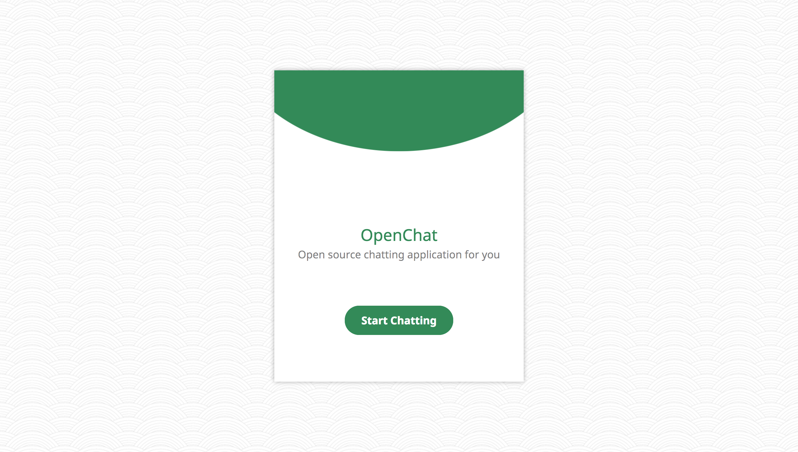
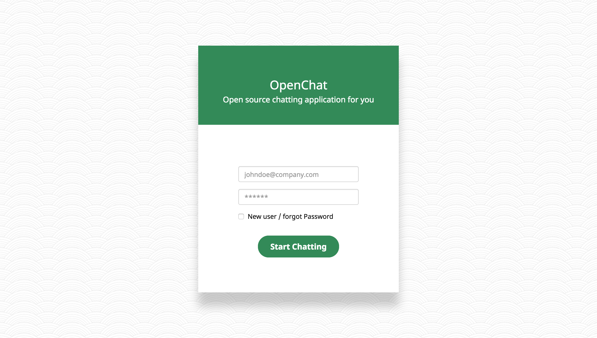
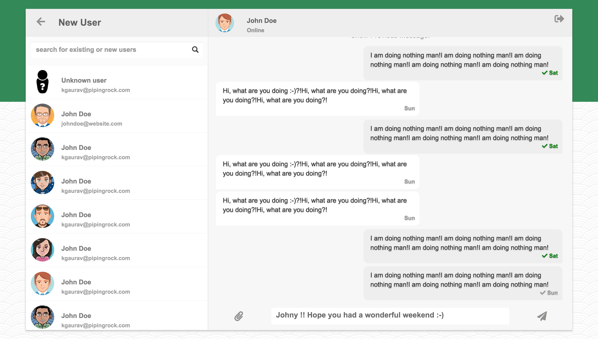
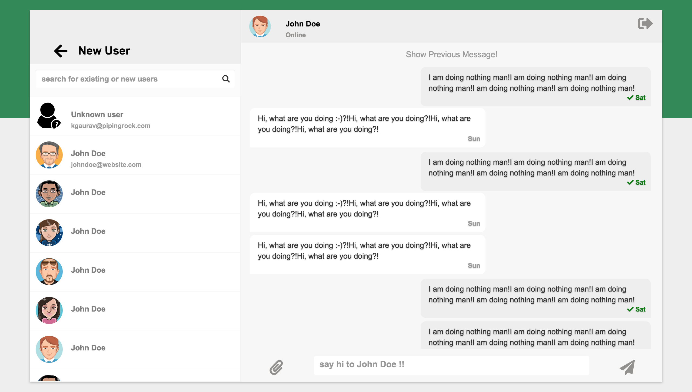
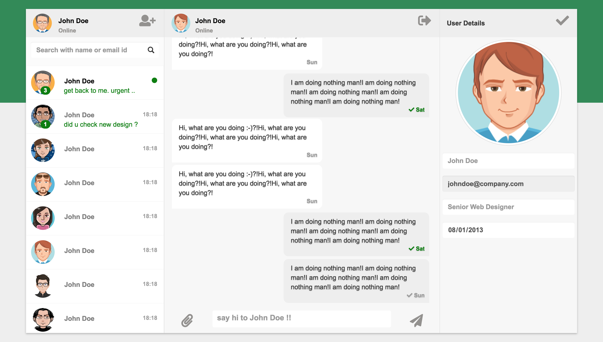

# OpenChat

## Demo

`coming soon`

## to get the project

```
git clone https://github.com/measdot/open-chat.git
```

## screens

* HOME



* LOGIN



* CHAT







Base template - https://bootdey.com/snippets/view/Whatsapp-web-chat-template
